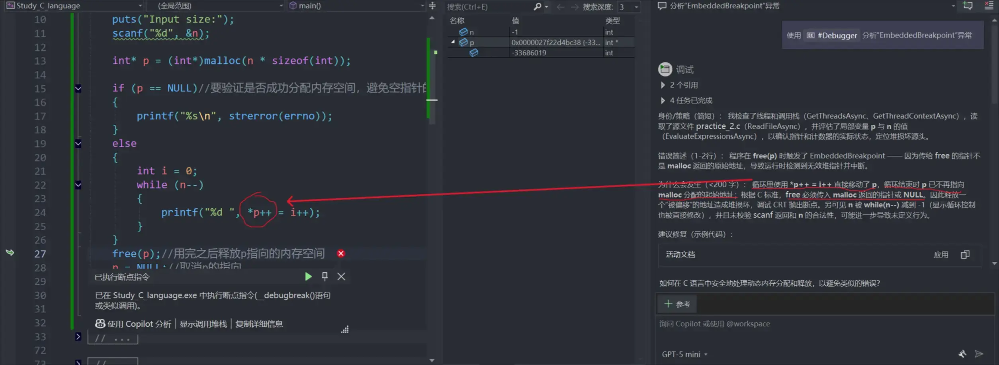

### `malloc()`动态内存分配
大多数情况下数据所需内存的空间大小是不固定，若固定分配内存空间，可能会导致内存偏小过内存过剩，这时就需要动态为数据开辟空间
注意：
- <mark style="background: #FFF3A3A6;">要验证是否成功开辟内存空间，避免对空指针的解引用</mark>（**警告 C6011** 表示代码可能在**未检查指针是否为 NULL** 的情况下直接解引用它，这会导致**未定义行为**甚至程序崩溃。常见于 _malloc_、_new_ 等内存分配失败后未做空指针判断的场景）
```c
int main()
{
	int n;
	puts("Input size:");
	scanf("%d", &n);

	int* p = (int*)malloc(n * sizeof(int));

	if (p == NULL)//要验证是否成功分配内存空间，避免空指针的解引用
	{
		printf("%s\n", strerror(errno));
	}
	else
	{
		int i = 0;
		for (i; i < n; i++)
		{
			*(p + i) = i;
		}
		for (i = 0; i < n; i++)
		{
			printf("%d ", *(p + i));
		}
	}
	free(p);//用完之后释放p指向的内存空间
	p = NULL;//取消p的指向
	
	return 0;
}
```

⚠️⚠️⚠️注意：

<mark style="background: #FF5582A6;">致命错误</mark> ：循环里使用 `*p++ = i++` 直接移动了 p，循环结束时 p 已不再指向 malloc 分配的起始地址；根据 C 标准，free 必须传入 **malloc 返回的指针或 NULL**

---

### 柔性数组Flexible Array Member
C语言中的**柔性数组**（Flexible Array Member）是C99标准引入的一种特性，允许在结构体的**最后一个成员**声明一个**没有指定长度**的数组，从而为结构体分配一块连续的内存，其中数组的实际大小可以在运行时动态决定。

#### 1. 基本语法


```c

struct flex_example {
    int count;          // 其他成员
    double values[];    // 柔性数组，不指定大小
};
```

注意：

- 柔性数组不能是结构体中唯一的成员（C99要求至少还有一个其他成员）。
    
- 柔性数组不占用结构体的直接大小（`sizeof` 计算时会忽略它），但会影响对齐填充。
    
- 在C11及以后标准中，柔性数组仍然有效。
    

#### 2. 内存分配与使用

柔性数组必须通过**动态内存分配**来获得实际空间。分配时，需要为结构体的固定部分加上柔性数组所需的大小。


```c

#include <stdio.h>
#include <stdlib.h>
struct flex {
    int len;
    char data[];
};
int main() {
    int n = 10;
    // 分配结构体 + 柔性数组的空间
    struct flex *p = malloc(sizeof(struct flex) + n * sizeof(char));
    if (!p) return 1;
    
    p->len = n;
    for (int i = 0; i < n; ++i)
        p->data[i] = 'a' + i;
    
    // 使用
    for (int i = 0; i < p->len; ++i)
        putchar(p->data[i]);
    putchar('\n');
    
    free(p);
    return 0;
}
```

输出：
text
abcdefghij

#### 3. 内存布局
假设结构体定义如下（考虑典型对齐）：

```c

struct demo {
    int a;      // 4字节
    double b;   // 8字节
    char c[];   // 柔性数组
};
```

- `sizeof(struct demo)` 通常等于 `sizeof(int) + sizeof(double)` 加上可能的填充（为了对齐 `double`）。在64位系统上，可能是16字节。
    
- 柔性数组的起始位置恰好紧跟在最后一个固定成员之后（可能包含必要的尾部填充，但C标准要求柔性数组不参与结构体大小计算）。
    

通过 `malloc(sizeof(struct demo) + N)` 分配的内存，前 `sizeof(struct demo)` 字节是结构体的固定部分，剩余 `N` 字节直接作为柔性数组的存储空间。


#### 4. 与指针替代方案的对比
在没有柔性数组之前，常用方法是使用指针成员指向额外分配的缓冲区：

```c

struct old_way {
    int len;
    char *data;
};

```
缺点：

- 需要两次内存分配（结构体一次，数据一次），容易造成内存碎片。
    
- 访问数据需要一次间接寻址（`p->data[i]`），性能略低。
    
- 释放时需要分别释放内部指针和结构体本身。
    

柔性数组的优势：

- **一次分配**：结构体和数据内存连续，减少碎片，提高缓存命中率。
    
- **释放简单**：一次 `free` 即可。
    
- **访问效率**：直接通过基址加偏移访问（`p->data[i]` 本质上是 `(char*)(p+1)[i]`）。
    


#### 5. 使用限制

- 柔性数组必须是结构体的**最后一个成员**。
    
- 不能使用 `static` 存储类说明符。
    
- 不能出现在包含柔性数组的数组或另一个结构体中（即不能嵌套柔性数组）。
    
- 使用 `=` 进行结构体赋值时，柔性数组**不会被复制**（因为编译器不知道其大小）。通常需要自己实现深拷贝。
    
- 对包含柔性数组的结构体使用 `sizeof` 不会包括柔性数组的大小。
    


#### 6. C标准相关

- **C99** 正式引入柔性数组（称为 _flexible array member_）。在此之前，一些编译器支持 `[0]` 或 `[1]` 的“结构体 hack”作为扩展。
    
- **C11/C17** 延续相同定义。
    
- **C++** 标准中**没有**柔性数组，但很多编译器（如GCC、Clang）将其作为扩展支持（使用 `[0]` 或 `[]`）。编写跨 C/C++ 代码时需注意。
    


#### 7. 常见应用场景

- 网络协议包：头部固定，负载可变。
    
- 动态字符串/缓冲区：一个结构体同时管理长度和内容。
    
- 消息队列中变长消息的表示。
    

示例：变长记录存储

```c

struct record {
    int id;
    size_t size;
    unsigned char data[];
};
struct record *create_record(int id, const unsigned char *src, size_t sz) {
    struct record *r = malloc(sizeof(struct record) + sz);
    if (r) {
        r->id = id;
        r->size = sz;
        memcpy(r->data, src, sz);
    }
    return r;
}
```


#### 8. 注意事项

- **不要直接定义柔性数组变量**，例如 `struct flex f;` 是无效的（或行为未定义），因为编译器不知道数组大小。
    
- 传递给函数时，通常通过指针传递。
    
- 使用 `realloc` 调整大小时要小心，可能改变柔性数组的地址，但结构体指针本身会更新。
    
- 计算偏移时，不要假设 `offsetof` 对柔性数组有效（C标准未定义），但实际编译器通常能正确计算前面成员的偏移。
    


#### 9. 示例：完整代码演示

```c

#include <stdio.h>
#include <stdlib.h>
#include <string.h>
typedef struct {
    int length;
    char buffer[];
} String;
String* string_new(const char *init) {
    size_t len = strlen(init);
    String *s = malloc(sizeof(String) + len + 1); // +1 for '\0'
    if (s) {
        s->length = len;
        strcpy(s->buffer, init);
    }
    return s;
}
void string_free(String *s) {
    free(s);
}
int main() {
    String *s = string_new("Hello, flexible array!");
    printf("Length: %d, Content: %s\n", s->length, s->buffer);
    string_free(s);
    return 0;
}
```

输出：
text
Length: 23, Content: Hello, flexible array!


#### 总结
柔性数组是C语言中实现**变长数据结构**的优雅方式，它让结构体拥有一个内嵌的、大小可变的数组，同时保持内存连续和分配/释放的简单性。理解其内存布局和使用限制，能帮助写出更高效、更清晰的C代码